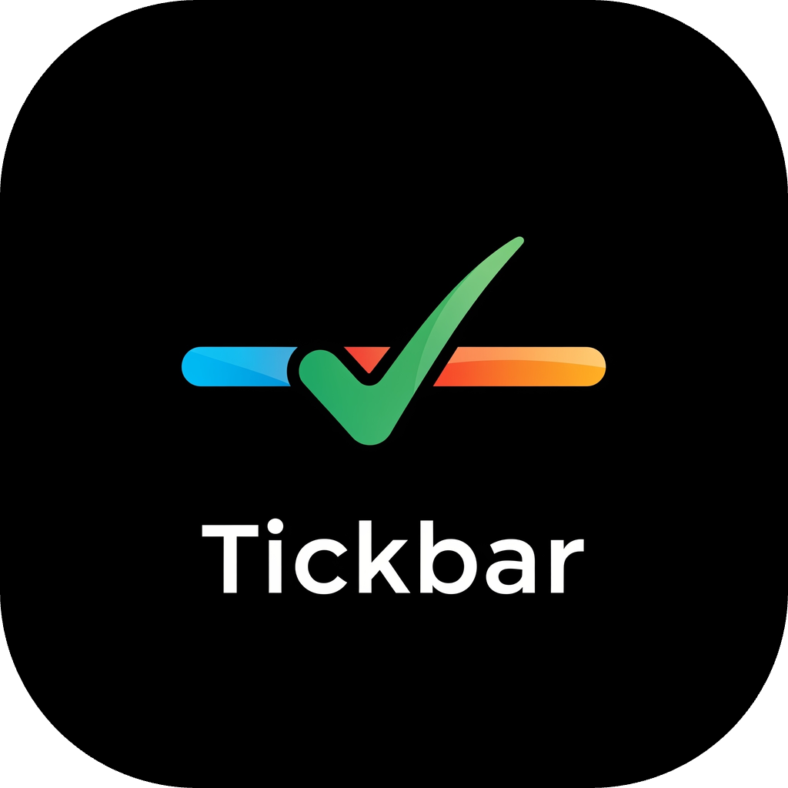
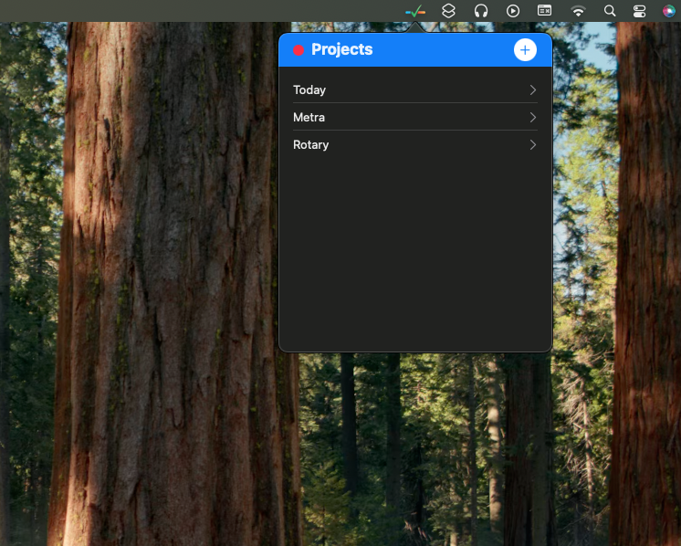
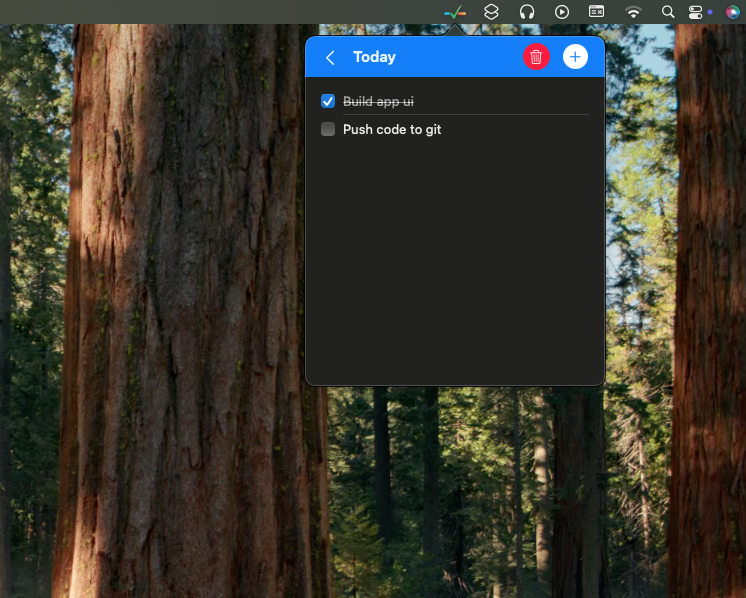

# ⏱️ TickBar 

<p align="center">
  
</p>

<p align="center">
  <b>Manage your projects to-do lists right from the macOS menu bar.</b><br/>
  Minimal, distraction-free, and always at your fingertips.
</p>

---

## ✨ Features

* 🖥️ Always accessible in the **macOS menu bar**
* 📝 **Quick task management** – add, edit, delete tasks instantly
* 📂 Organize tasks **per project**
* 💾 **Local storage** – your data stays with you
* 🎨 Simple, clean **macOS-native UI**

---

## 📸 Screenshots

| Projects                          | Tasks                        |
|-----------------------------------|------------------------------|
|  |  |

---

## 🚀 Installation

1. Clone the repo:

   ```bash
   git clone https://github.com/jatinsakshiB/TickBar.git
   cd tickbar
   ```
2. Open **`TickBar.xcodeproj`** in Xcode
3. Select a scheme and **Run** ▶️

---

## 🛠️ Requirements

* macOS **12.0+**
* Xcode **14+**

---

## 🤝 Contributing

We love contributions! 💙

* Fork the repo
* Create your feature branch → `git checkout -b feature/my-feature`
* Commit → `git commit -m "Added my feature"`
* Push → `git push origin feature/my-feature`
* Open a Pull Request 🚀

---

## 💡 About

**TickBar** is made with ❤️ for macOS users who want a **lightweight, distraction-free project manager** right in the menu bar.
Perfect for developers, students, and productivity enthusiasts.
